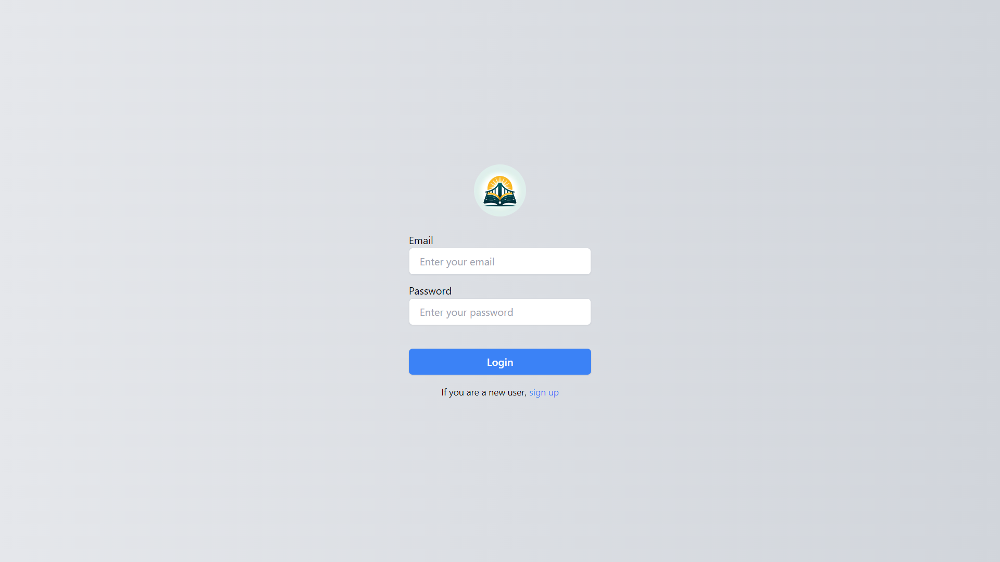
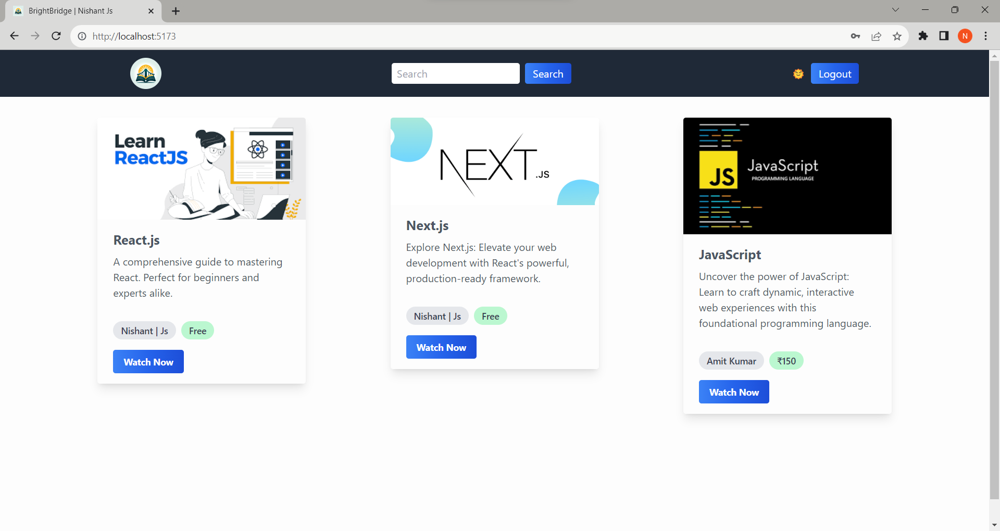

BrightBridge is an innovative e-learning platform that revolutionizes the way educational content is created, accessed, and managed. Built using cutting-edge technologies like `TypeScript, Node.js, Express.js, MongoDB, ReactJS, and TailwindCSS`, this project offers a seamless and interactive user experience. Key features include:

-   **User Authentication:** Secure login and signup functionality.
-   **Course Management:** Intuitive tools to create, view, edit, and delete courses.
-   **CRUD Operations:** Robust Create, Read, Update, and Delete capabilities for managing educational content.
-   **Responsive Design:** Crafted with TailwindCSS for a flexible, mobile-first design.
-   **Backend Efficiency:** Leveraging Node.js and Express.js for fast and scalable server-side logic.
-   **Database Integration:** Utilizing MongoDB for efficient data storage and retrieval.
-   **Frontend Innovation:** Employing ReactJS for dynamic and responsive user interfaces.

 <!-- "test": "yarn build && jest",
        "start": "cd ../frontend && npm run build && rm -rf ../backend/public && mkdir -p ../backend/public && mv ./dist/*  ../backend && node dist/server.js", -->
